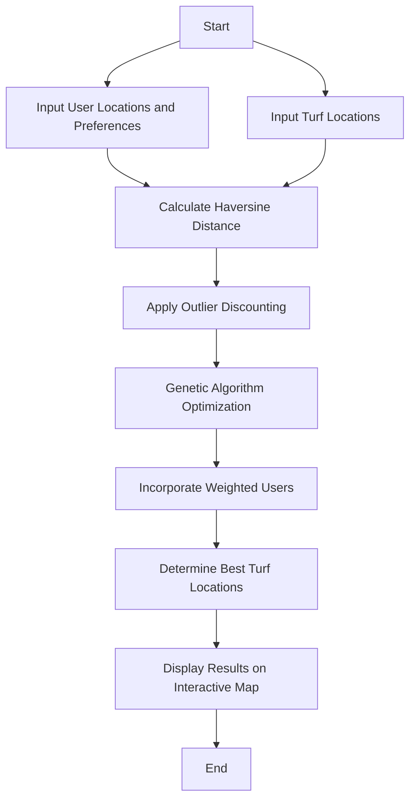

# Genetic Turf Finder

## Table of Contents
- [Live Demo](#live-demo)
- [Overview](#overview)
- [Genetic Algorithm](#genetic-algorithm)
  - [Why Genetic Algorithms?](#why-genetic-algorithms)
- [Outlier Discounting](#outlier-discounting)
- [Haversine Distance](#haversine-distance)
- [Weighted Users](#weighted-users)
- [Potential Work Areas](#potential-work-areas)
- [Motivation](#motivation)
- [Features](#features)
- [Installation and Setup](#installation-and-setup)
- [Running the Application](#running-the-application)

## Live Demo
Check out the live demo of Genetic Turf Finder [here](https://genturf.streamlit.app).

## Overview
The Genetic Turf Finder uses a **genetic algorithm** to determine **best turf locations** based on user inputs. This leverages the promise of genetic algorithms - to provide **suboptimal yet satisfactory solutions** with less computational demand and flexibility.

**Input:** Turf locations, user locations, and user preferences.  
**Output:** The best-suited turf(s).

## Genetic Algorithm
The core of this application is a genetic algorithm, which is well-suited for problems where exact solutions are not necessary, the solution space is vast with numerous variables, making the problem computationally intensive or NP-hard in nature. Genetic algorithms mimic the process of natural selection, providing a robust method for optimization.

### Why Genetic Algorithms?
- **Suboptimal Solutions**: Genetic algorithms are ideal for scenarios where a perfect solution is not required. They provide good enough solutions that are computationally efficient.
- **Flexibility**: These algorithms can adapt to various constraints and requirements, making them versatile for different optimization problems.
- **Computational Efficiency**: Low compute-time and resources required.



## Outlier Discounting
Users who are identified as outliers are excluded from the optimization process, which helps improving Turf suggestions because of diminishing sensitivity of distance. This is done by calculating the standard deviation of user locations and allowing users to set a threshold to determine which locations are considered outliers. By excluding these outliers, the algorithm can focus on optimizing turf locations for the majority of users, leading to more reliable results. Small differences in shorter distances (e.g., 1 km vs. 3 km) are perceived as more significant than similar differences in longer distances (e.g., 35 km vs. 37 km).

## Haversine Distance
Haversine distance is used to calculate distance between 2 points on the Earth's surface taking into account the curvature. This is more accurate opposed to regular euclidean distance, since we are dealing with geographic locations. This can be replaced with ground-truth travel distance, and extra variables like the traffic, time taken, and so on can be accounted for. 

## Weighted Users
To prioritise the distance travelled by a certain user, in our optimization strategy, a priority user is given a weight of 1, while other users are assigned a weight of 0.5. This weighting influences the genetic algorithm to favor solutions that are closer to the priority user. This feature showcases the flexibility of the algorithm. 

## Potential Work Areas
- **Distance metric**
  - Distance metric could be **upgraded to suit real-world variables like travel time and travel distance, varying mode of transport, and the like**.
- The **genetic algorithm** - chromosome representation, fitness function, selection function, crossover function, mutation function, & more.
  - This can be improved to produce better solutions, in faster time.
- **Outlier Discounting**.
  - Outliers could be identified based on input from the user or better mathematical models.
- **Weighted Users**.
  - Multiple users could be assigned varying weights by the user.
 
## Motivation
Genetic Turf Finder is intended as a prototype for business like [Playo](https://playo.co) & [Turf Town](https://turftown.in), to enable users to find a closest turf for a group or smartly handle outliers, making the process effortless and intuitive. Easier decision-making, happier turf-goers. 

## Features
- Interactive map visualization with user and turf locations.
- Customizable optimization strategies including user prioritization and outlier discounting.
- Real-time results display with initial and re-optimized turf locations (with Outlier Discounting).

## Installation and Setup
To set up the Genetic Turf Finder locally, follow these steps:

1. **Clone the Repository**:
   ```bash
   git clone https://github.com/SheriffAbdullah/genetic_turf_finder.git
   cd genetic_turf_finder
   ```

2. **Install Dependencies**:
   Ensure you have Python installed, then run:
   ```bash
   pip install -r requirements.txt
   ```

## Running the Application
To run the Streamlit application, execute the following command:
```bash
streamlit run streamlit_app.py
```
This will start the app and open it in your default web browser.

## Contributing
We welcome contributions to the Genetic Turf Finder project. To contribute:

1. Fork the repository.
2. Create a new branch for your feature or bugfix.
3. Commit your changes and push them to your fork.
4. Submit a pull request with a description of your changes.

## License
This project is licensed under the MIT License - see the [LICENSE](LICENSE) file for details.
